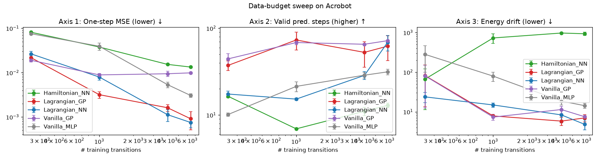
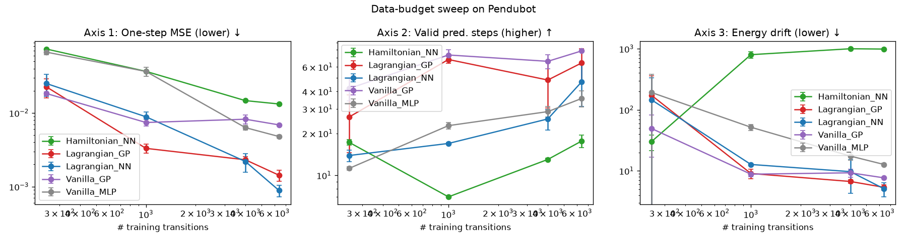
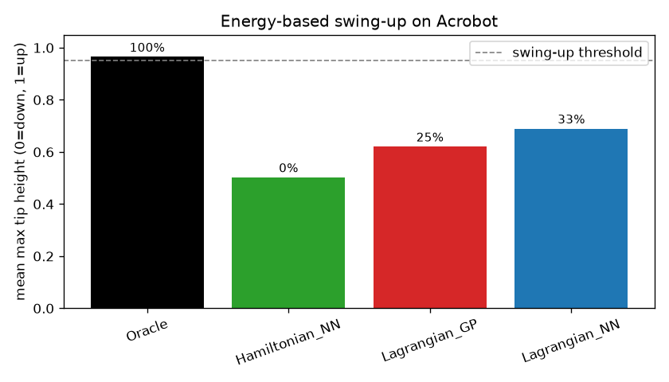
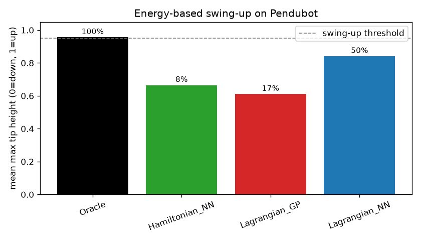

# Benchmark results

Physics-informed dynamics models for underactuated swing-up. Five models (Vanilla MLP, Lagrangian NN, Hamiltonian NN, Vanilla GP, Lagrangian GP) on Acrobot and Pendubot, across four axes.

## Dynamics — Acrobot (largest budget n_train=6400)

| Model | One-step MSE ↓ | Valid steps ↑ | Energy drift ↓ | Diverged |
|---|---|---|---|---|
| Hamiltonian_NN | 1.34e-02 | 12.9 | 9.32e+02 | 60% |
| Lagrangian_GP | 9.12e-04 | 62.3 | 7.00e+00 | 0% |
| Lagrangian_NN | 7.51e-04 | 68.8 | 4.84e+00 | 0% |
| Vanilla_GP | 9.89e-03 | 72.0 | 7.53e+00 | 0% |
| Vanilla_MLP | 3.05e-03 | 31.5 | 1.43e+01 | 0% |

## Dynamics — Pendubot (largest budget n_train=6400)

| Model | One-step MSE ↓ | Valid steps ↑ | Energy drift ↓ | Diverged |
|---|---|---|---|---|
| Hamiltonian_NN | 1.32e-02 | 17.6 | 9.87e+02 | 87% |
| Lagrangian_GP | 1.43e-03 | 64.1 | 5.38e+00 | 0% |
| Lagrangian_NN | 8.86e-04 | 46.8 | 5.09e+00 | 0% |
| Vanilla_GP | 6.88e-03 | 78.2 | 7.68e+00 | 0% |
| Vanilla_MLP | 4.78e-03 | 35.6 | 1.27e+01 | 0% |

## Swing-up control (Axis 4) — Acrobot

| Model | Mean tip height (0–1) | Success rate |
|---|---|---|
| Oracle | 0.965 | 100% |
| Hamiltonian_NN | 0.503 | 0% |
| Lagrangian_GP | 0.620 | 25% |
| Lagrangian_NN | 0.689 | 33% |

## Swing-up control (Axis 4) — Pendubot

| Model | Mean tip height (0–1) | Success rate |
|---|---|---|
| Oracle | 0.956 | 100% |
| Hamiltonian_NN | 0.665 | 8% |
| Lagrangian_GP | 0.611 | 17% |
| Lagrangian_NN | 0.841 | 50% |

## Figures

